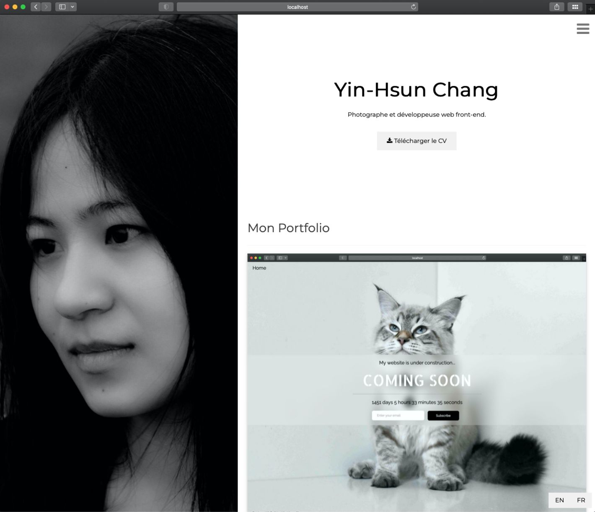

# Front-end Developer Portfolio

This is my personal portfolio website, built with Vite, React, and TypeScript, where I share some projects I’ve worked on and the skills I’ve been developing.

I tried to focus on clean layouts, readable typography, and an intuitive user experience. The site also includes bilingual support (English / French) and a responsive design for mobile, tablet, and desktop devices.

Drawing on my background in photography and interior design, I aimed to create a site that feels simple, balanced, and visually pleasant.

---

## Demo

[](https://yinhsunchang.github.io/portfolio)

---

## Features

- Bilingual support (English / French) using i18n
- Dynamic document title & meta tags with React Helmet
- Download language-specific CV files based on selected language
- Smooth scrolling navigation
- Hover Zoom on Cards
- Responsive layout for mobile, tablet, and desktop devices.

---

## Tech Stack

- Frontend: Vite, React, TypeScript
- Styling: CSS
- Fonts & Icons: Google Fonts, Font Awesome
- Internationalization: i18n
- Head Management / SEO: React Helmet

---

## Website Sections

- Hero Section: Name, role, and personal branding
- Portfolio: Selected front-end projects
- About: Background and experience
- Skills: Technical, creative, and language skills
- Contact: Contact information

---

## Getting Started

Follow the steps below to run the project locally.

```bash
# 1. Clone the repository
git clone https://github.com/yinhsunchang/portfolio.git
cd portfolio

# 2. Install dependencies
npm install

# 3. Run the development server
npm run dev
```

---

## License, Copyright & Credits

- Code License: MIT License © Yin-Hsun Chang. See the [LICENSE](LICENSE) file for details.
- Images & Media: © Yin-Hsun Chang. All images and media files are not covered by the MIT License and may not be used without permission.
- Third-Party Resources: This project uses third-party resources, which are subject to their respective licenses. Examples include: Google Fonts, Font Awesome
- Design Reference: Inspired by the W3Schools "Black & White Portfolio" template.
